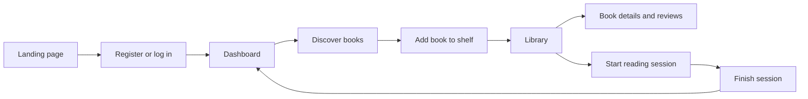
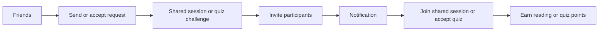

# Bookshelf Client

Bookshelf is a social reading application for tracking personal reading progress, organizing books into shelves, and sharing the reading habit with friends. The client gives users a focused interface for discovering books, managing their library, starting reading sessions, viewing progress, and interacting with social features such as friends, shared shelves, quizzes, and notifications.

The motivation is simple: reading apps often track books, but they rarely make the day-to-day act of reading feel social and rewarding. Bookshelf combines library management with lightweight community features so users can turn reading into a visible, shared routine.

## Technologies

- [Next.js](https://nextjs.org/) 15 with React 19 and TypeScript
- [Ant Design](https://ant.design/) and custom CSS modules/stylesheets
- STOMP over SockJS for live notification/session updates
- Google Books API proxy route for discovery
- Deno lint/format tooling and npm scripts for local development
- Vercel deployment workflow

## High-Level Components

### Application Shell and Navigation

The global layout in [app/layout.tsx](./app/layout.tsx) wraps the application, while [app/components/sidebar.tsx](./app/components/sidebar.tsx) and [app/components/topbar.tsx](./app/components/topbar.tsx) provide the main navigation, logout, and notification entry points. Authenticated pages share this shell so users can move between dashboard, library, discovery, sessions, friends, and quizzes consistently.

### API and Session State

All backend calls go through [app/api/apiService.ts](./app/api/apiService.ts), which centralizes the base URL, headers, response parsing, and error handling. [app/hooks/useApi.ts](./app/hooks/useApi.ts) connects that service to the current auth token stored through [app/hooks/useLocalStorage.tsx](./app/hooks/useLocalStorage.tsx). Environment selection is handled by [app/utils/domain.ts](./app/utils/domain.ts), which points development builds to `http://localhost:8080` and production builds to the deployed server.

### Book Discovery and Library Management

[app/discover/page.tsx](./app/discover/page.tsx) searches Google Books through [app/api/books/route.ts](./app/api/books/route.ts), supports genre/rating filters, and lets users add API or manually entered books to a shelf. [app/library/page.tsx](./app/library/page.tsx) then renders the user's shelves, supports shelf creation/renaming/deletion, and lets users remove books. [app/books/[id]/page.tsx](<./app/books/[id]/page.tsx>) shows detailed book information and reviews.

### Reading Sessions and Progress

[app/session/page.tsx](./app/session/page.tsx) lets a user pick a shelf book, start a timed reading session, update pages read, and finish the session so progress is persisted by the backend. [app/shared/page.tsx](./app/shared/page.tsx) extends the same idea to shared sessions with friends.

### Social Features and Notifications

[app/friends/page.tsx](./app/friends/page.tsx) handles friend search, friend requests, and friend profiles. [app/components/context/notificationProvider.tsx](./app/components/context/notificationProvider.tsx), [app/hooks/useNotifications.ts](./app/hooks/useNotifications.ts), and [app/utils/websocket.ts](./app/utils/websocket.ts) coordinate notification polling and STOMP/SockJS connectivity for real-time updates.

### Quizzes and Reading Challenges

[app/quiz/page.tsx](./app/quiz/page.tsx) provides the quiz interface where users can create book quizzes, choose friends to challenge, accept incoming quizzes, and compare scores on a points leaderboard. This feature is currently implemented as a client-side UI flow with local example data; the next backend integration step is to persist quizzes, send quiz invitations, accept challenges, and award points through the API.

## Launch & Deployment

### Prerequisites

- Node.js 18 or newer
- npm
- Deno, if you want to run the configured lint/format commands directly
- The Bookshelf server running locally on `http://localhost:8080`

The client expects the backend API at `http://localhost:8080` in development. In production, set `NEXT_PUBLIC_PROD_API_URL` or let the fallback in [app/utils/domain.ts](./app/utils/domain.ts) point to the App Engine deployment.

### Local Setup

```bash
npm install
npm run dev
```

Open [http://localhost:3000](http://localhost:3000). Start the server repository first if you want login, library, sessions, friends, and notifications to work end to end.

### Build and Run Production Locally

```bash
npm run build
npm run start
```

### Quality Checks

```bash
npm run lint
npm run fmt
```

There is currently no dedicated client test suite in `package.json`. For client changes, run linting and manually verify the affected user flow against a running backend.

### Docker

```bash
docker build -t bookshelf-client .
docker run -p 3000:3000 bookshelf-client
```

### Releases

The repository contains a Vercel deployment workflow in [.github/workflows/verceldeployment.yml](./.github/workflows/verceldeployment.yml). Pushing to `main` deploys the production client when the GitHub secrets `VERCEL_TOKEN`, `VERCEL_ORG_ID`, and `VERCEL_PROJECT_ID` are configured. The Docker workflow can also publish an image when the Docker Hub secrets described in the workflow are available.

## Illustrations

### Main User Flow



A new user starts on [app/page.tsx](./app/page.tsx), creates an account in [app/register/page.tsx](./app/register/page.tsx), and lands in the authenticated dashboard. From there, the user can search for books in Discover, add a title to a shelf, manage shelves in Library, and open the book detail view for reviews.

### Social Reading Flow



Friends and notifications connect the solo library workflow to shared reading. A user can find another user, become friends, invite them to sessions or shared shelves, and receive updates through the notification layer. The quiz page extends this social loop with challenge creation, quiz acceptance, score comparison, and quiz points; at the moment, this flow is represented in the client UI and still needs backend persistence and live invitation handling.

## Roadmap

- Add a client-side test suite with React Testing Library and end-to-end coverage for login, discovery, library, and sessions.
- Improve offline and error states so users can keep navigating cached library data when the backend or Google Books API is unavailable.
- Connect quizzes to the backend so users can persist quiz challenges, accept them from notifications, submit answers, and receive points.

## Authors and Acknowledgment

Built by SoPra FS26 Group 35:

- [@juylein](https://github.com/juylein)
- [@missbo-cyber](https://github.com/missbo-cyber)
- [@vanmey](https://github.com/vanmey)
- [@fraiaperezrayonforsman-cloud](https://github.com/fraiaperezrayonforsman-cloud)
- [@minhgou](https://github.com/minhgou)

This project was developed for the Software Engineering Lab at the University of Zurich. We also acknowledge the SoPra teaching team and the open-source projects that make the stack possible.

## License

This project is licensed under the Apache License 2.0. The backend repository contains the full [LICENSE](https://github.com/juylein/sopra-fs26-group-35-server/blob/main/LICENSE) text.
